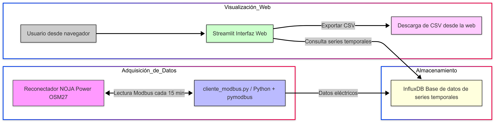

# Diagrama del Sistema

A continuación se presenta el diagrama general del sistema a desplegar. Este diagrama ilustra la arquitectura y los principales componentes involucrados en la solución de monitoreo basada en TCP/IP.

