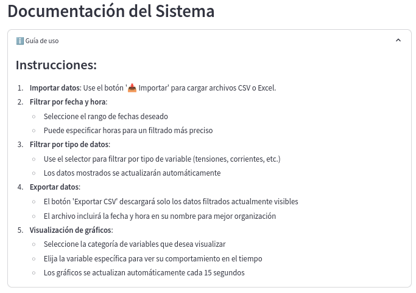
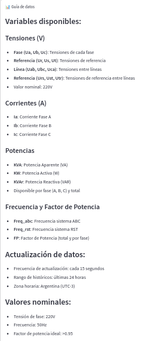
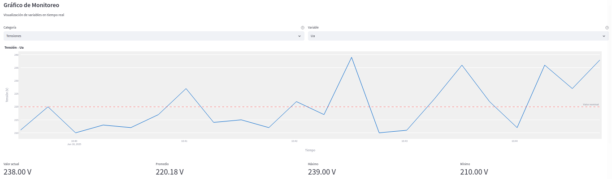
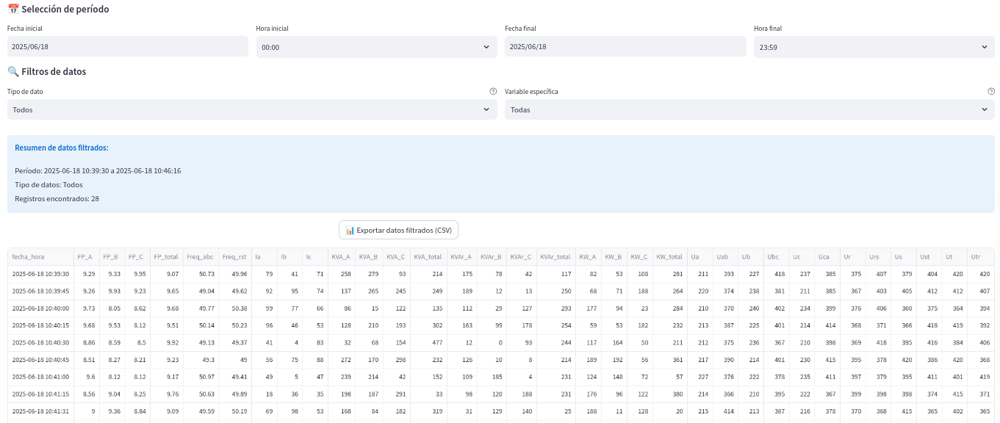
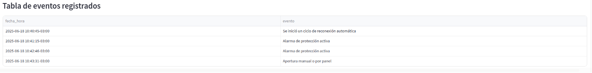

# Documentación de la aplicación Streamlit

Esta sección documenta la interfaz web del sistema de monitoreo, implementada usando Streamlit. La aplicación proporciona una interfaz amigable para visualizar, monitorear y exportar datos del recloser OSM27.

## Estructura de archivos

```
Streamlit/
├── streamlit_app.py
├── requirements.txt
└── assets/
    ├── escudo_ing1.png
    ├── ipsep_logo.jpeg
    ├── Logo_unrc_horizontal2.png
    └── unrc_logo.jpg
```

## Requisitos de la aplicación

La aplicación requiere las siguientes dependencias, listadas en `requirements.txt`:

```text
streamlit==1.31.0
pandas
plotly
openpyxl
mitosheet
influxdb-client
streamlit-autorefresh
```

## Funcionalidades principales

### 1. Guía de uso

La aplicación está diseñada para ser intuitiva y fácil de usar.



**Características:**
- Instrucciones paso a paso
- Explicación de todas las funcionalidades
- Referencias rápidas
- Ayuda interactiva

### 2. Guía de datos

Incluye documentación integrada sobre los datos mostrados.



**Características:**
- Descripción de variables
- Unidades de medida
- Referencias técnicas
- Ayuda contextual

### 3. Monitoreo en tiempo real

La aplicación muestra gráficos en tiempo real de las variables del recloser.



**Características:**
- Actualización automática cada 15 segundos
- Gráficos interactivos usando Plotly
- Visualización de múltiples variables en simultáneo
- Zoom y herramientas de navegación

### 4. Exportación de datos

Permite exportar los datos mostrados en diferentes formatos.



**Características:**
- Exportación a CSV y Excel
- Selección de rango de fechas
- Filtrado de variables a exportar
- Descarga directa desde la interfaz

### 5. Tabla de eventos

Muestra los eventos importantes registrados por el recloser.



**Características:**
- Registro cronológico de eventos
- Descripción detallada de cada evento
- Actualización automática
- Filtrado por fecha y hora


## Guía de uso

La aplicación está diseñada para ser intuitiva y fácil de usar.


**Pasos básicos:**
1. Inicie sesión con sus credenciales institucionales
2. Explore los gráficos de monitoreo en tiempo real
3. Revise la tabla de eventos si necesita información específica
4. Use las herramientas de filtrado para analizar períodos específicos
5. Exporte los datos cuando necesite análisis offline

## Código principal (`streamlit_app.py`)

El archivo principal contiene toda la lógica de la aplicación:

- Sistema de autenticación
- Conexión con InfluxDB
- Visualización de datos
- Manejo de eventos
- Exportación de datos
- Interfaz de usuario

El código está organizado en secciones claras y documentadas, facilitando su mantenimiento y extensión.

## Configuración y despliegue

Para ejecutar la aplicación:

1. **Instalar dependencias:**
```bash
pip install -r requirements.txt
```

2. **Ejecutar la aplicación:**
```bash
streamlit run streamlit_app.py
```

3. **Acceder a la interfaz web:**
- Abra su navegador en `http://localhost:8501`
- Inicie sesión con sus credenciales
- ¡Comience a monitorear!

La aplicación se actualizará automáticamente cada 15 segundos para mostrar los datos más recientes del recloser.