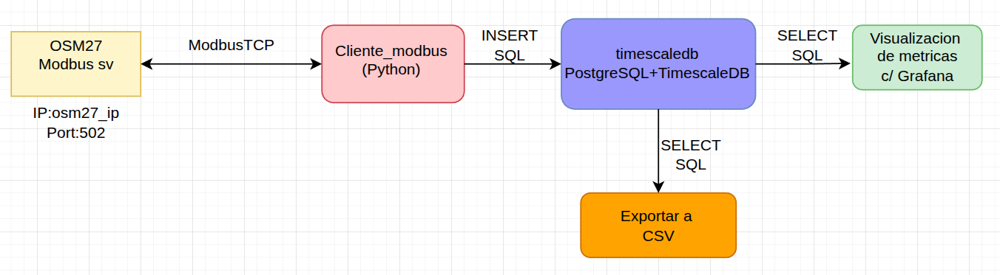

# TP_FINAL_TCP_IP_2025_Grupo_2

## Sistema de Monitoreo para Reconectador Automático NOJA Power

Este proyecto implementa un stack dockerizado para leer métricas desde un reconectador OSM27 vía ModbusTCP, almacenar los datos en una base de datos TimescaleDB (PostgreSQL con extensiones para series temporales), visualizarlos en Grafana y exportarlos a un archivo con extension CSV.

### Funcionamiento general del Stack

1. ModbusTCP es una variante de Modbus que funciona sobre TCP/IP.

2. El OSM27 actúa como servidor Modbus, escuchando en un puerto (por defecto  es el 502).

3. Un cliente Modbus (en Python, con pymodbus) se conecta al OSM27, lee registros (holding registers, input registers, coils o discrete inputs).

4. El cliente parsea esos valores y los guarda en la base de datos PostgreSQL con TimescaleDB.

5. Grafana se conecta a PostgreSQL y permite visualizar las métricas.

6. Un servicio adicional exportador genera archivos CSV desde los datos de la base.

## Descripción General

### PostgreSQL

PostgreSQL es un sistema de gestión de bases de datos relacional de código abierto muy robusto. En este proyecto se usa para almacenar los datos de mediciones eléctricas.

### TimescaleDB

TimescaleDB es una extensión para PostgreSQL diseñada para manejar series temporales de forma eficiente. Permite crear _hypertables_ que optimizan el almacenamiento y consulta de grandes volúmenes de datos con marcas de tiempo, ideal para lecturas de sensores y mediciones.

**Ventajas en este stack:**
- Consultas rápidas con filtros por fecha y hora.
- Compresión y particionamiento automático de datos.
- Integración con PostgreSQL.

###  Base de Datos

Tabla: `mediciones`

| Campo     | Tipo       |
|-----------|------------|
| id        | SERIAL      |
| fecha_hora| TIMESTAMPTZ |
| ia, ib, ic| FLOAT       |
| va, vb, vc| FLOAT       |
| p_act     | FLOAT       |
| p_react   | FLOAT       |
| fp        | FLOAT       |
| estado    | INTEGER     |

### Libreria pymodbus

`pymodbus` es una librería de Python para comunicarse con dispositivos Modbus, incluyendo ModbusTCP. Permite actuar como cliente o servidor y realizar lecturas y escrituras sobre registros de dispositivos industriales.

### Libreria psycopg2

psycopg2 es la librería de Python más utilizada para conectarse y trabajar con bases de datos PostgreSQL. Es un driver de base de datos que permite a Python ejecutar consultas SQL, obtener resultados y manejar conexiones con servidores PostgreSQL.

### Permite:
* **Conectarse a una base de datos PostgreSQL.**
Se envian parametros como host, puerto, base de datos, usuario y contraseña, y abre una conexión.
* **Ejecuta consultas SQL**
Ejecucion de comandos como SELECT, INSERT, UPDATE, DELETE, creacion de tablas, etc.
* **Lee resultados de consultas**
Devuelve los resultados de las consultas en estructuras de datos de Python, como listas de tuplas.

* **Manejo de transacciones**
psycopg2 usa transacciones por defecto. Tenés que hacer commit() para guardar los cambios o rollback() si hay errores.

* **Manejo de errores y excepciones de base de datos**
Permite capturar errores específicos de PostgreSQL y manejar problemas de conexión o consultas fallidas.

###  Servicios

- **timescaledb**: Base de datos TimescaleDB.
- **cliente_modbus**: Lee los registros ModbusTCP del OSM27 y almacena en TimescaleDB.
- **exportador**: Exporta registros desde la base de datos a un archivo CSV bajo demanda.
- **grafana**: Visualización de métricas.

##  Archivos Importantes

- `docker-compose.yml`: Orquesta los servicios.
- `./db/init/init.sql`: Crea la tabla `mediciones` en TimescaleDB.
- `./modbus-cliente/cliente_modbus.py`: Cliente ModbusTCP para lectura de métricas.
- `./exportador/exportar_csv.py`: Exportador de datos a CSV.
- `./grafana/provisioning/`: Configuración automática de datasource y dashboards.
- `.env`: Variables de entorno.

### ModbusTCP (Conexion con el OSM27)

Funcionamiento:

1. El script cliente_modbus.py realiza la lectura de las metricas del equipo bajo los requerimientos que se establecieron.

2. Cuando se utilice el equipo, se deberá conectar vía IP y puerto configurado en el cliente Modbus (dentro del contenedor).

3. Las lecturas se insertan en la tabla mediciones en TimescaleDB.

4. Grafana lee en tiempo real las métricas y las grafica.

